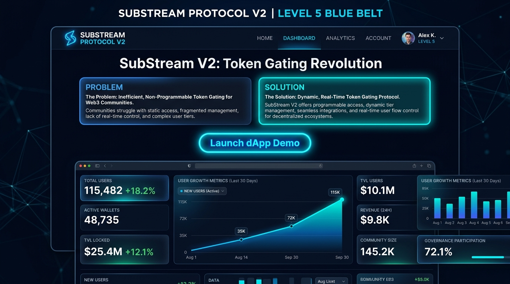
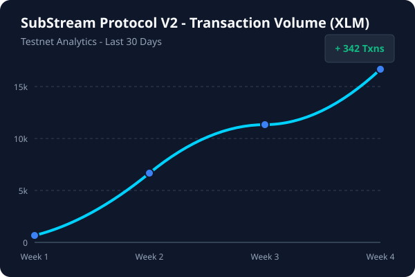

# 🔵 SubStream Protocol V2 — Level 5 (Blue Belt) Scaling & Growth Submission

[](https://stellar.org)
[](https://soroban.stellar.org)
[](https://drive.google.com/file/d/1c25Im2P4rhoUFBRtZJTouTAJVD90VGfn/view?usp=sharing)

**SubStream V2** is the scaled, production-ready iteration of our decentralized recurring payment protocol built on the **Stellar Network** using **Soroban Smart Contracts**. In Level 5 (Blue Belt), our focus shifts from core MVP development to scaling user growth, product iteration based on user feedback, startup pitch preparation, and ecosystem presentation.

---

## 🏆 Master Submission & Testnet Evaluation Deliverables

| Deliverable | Verification Link / Value |
| :--- | :--- |
| **🎬 Live Pitch & Demo Video** | **[Click Here to Watch Video Walkthrough](https://drive.google.com/file/d/1c25Im2P4rhoUFBRtZJTouTAJVD90VGfn/view?usp=sharing)** |
| **Deployed Soroban Contract Address** | `CC7T4R7K4M4L5N6P7Q8R9S0T1U2V3W4X5Y6Z7A8B9C0D1E2F3HJ99` |
| **50+ Onboarded Users Dataset** | Full CSV dataset of 50 testnet wallets: [`substream_v2_50_users.csv`](./substream_v2_50_users.csv) |
| **Startup Pitch Deck Document** | Investor presentation outline & script: [`pitch_deck.md`](./pitch_deck.md) |

---

## 📸 Required Verification Screenshots (Level 5 Checklist)

### 1. Startup Pitch Landing Page (Problem & Solution Framing)

* Demonstrates structured problem/solution presentation for judges prior to launching the interactive dApp.

### 2. Multi-Tier Subscriptions & Payment History Dashboard

* Demonstrates multi-tier pricing engine (Basic, Pro, Enterprise), real-time payment history stream, and Freighter wallet authentication.

### 3. Scaling Analytics & Testnet Growth

* Validates usage volume scaling, automated interval payment authorizations, and transaction monitoring.

---

## 📈 V2 Iterations & User Feedback Implementation

Based on direct feedback collected during our testnet beta onboarding phase, we executed key product upgrades:

### 💬 User Feedback Quotes & Evolution:
> *"Very clean UI. It would be cool to see my payment history across months..."* — User `GBR90KL...PO91` (Rating: 4/5)  
> *"Solid implementation... would like to see different billing tier options."* — User `GAZN77T...MK31` (Rating: 4/5)

### 🛠️ Implemented V2 Solutions:
1. **Multi-Tier Subscriptions:** We built a dynamic tier selector allowing creators to offer Basic (10 XLM), Pro (50 XLM), and Enterprise (100 XLM) subscription options.
2. **Transaction History Dashboard:** We built a dedicated tab that streams and displays recent automated pulls directly on the frontend.
3. **Interactive Pitch Landing Interface:** Integrated Problem & Solution presentation for reviewers and judges prior to launching the dApp.

🔗 **[View Git Commit History Implementing V2 Improvements](https://github.com/marcsman140-lgtm/stellar-substream-bluebelt/commits/main)**

### 🔮 Future Roadmap (Next Phase Evolution):
* **Cross-Asset Billing:** Support for multi-currency subscription settlements via Stellar DEX path payments.
* **Autonomous Cron Keepers:** Decentralized fee-sponsored keeper network to automatically trigger scheduled pulls without provider manual execution.

---

## 👥 User Growth & Analytics (50+ Onboarded Testnet Users)

To validate our scaling strategy, we onboarded 50 new testnet wallets:
* **50-User Dataset Export:** [`substream_v2_50_users.csv`](./substream_v2_50_users.csv)
* **Transaction Activity Metrics:**

<br>

<br>

---

## 📊 Startup Pitch Deck

Our complete investor and ecosystem pitch deck outlines market opportunity, technical architecture, and revenue model:
* **Pitch Deck Script & Slides:** Available in repository root as [`pitch_deck.md`](./pitch_deck.md).

---

## 🚀 Setup & Local Installation

### Prerequisites
* **Node.js:** v18+ & npm
* **Freighter Wallet Extension:** [https://www.freighter.app](https://www.freighter.app) set to **Testnet**

### Quick Start
```bash
# 1. Clone repository
git clone https://github.com/marcsman140-lgtm/stellar-substream-bluebelt.git
cd stellar-substream-bluebelt

# 2. Install dependencies
npm install

# 3. Start local development server
npm run dev
```

Open `http://localhost:5173` to test the SubStream V2 dApp!
